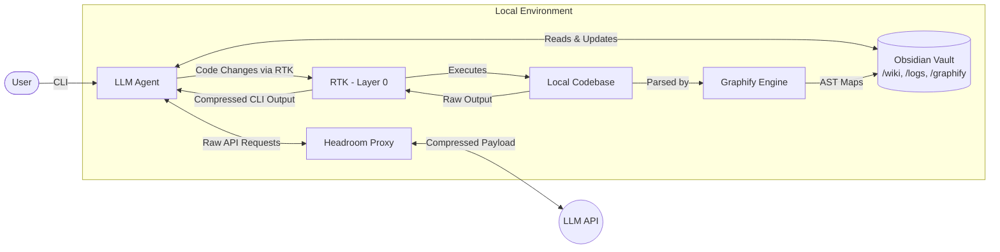

# AI Research Ecosystem


**An integrated ecosystem for AI/ML research workflow optimization, driven by Persistent Memory and Autonomous Agents.**

This repository establishes a comprehensive architecture that transforms LLMs (such as Google Antigravity and Claude Code) into a highly specialized **Research Assistant**. It optimizes the entire scientific lifecycle—from literature review and data engineering to model training and paper writing—while drastically reducing token consumption through a Zettelkasten-based persistent memory state machine. By moving context from the LLM prompt window into a persistent, searchable graph, we allow frontier models to focus their context on *reasoning* rather than *reading*.


## The Research Assistant Ecosystem

Rather than treating AI as a simple chatbot, this architecture provides a structured, rigorous methodology for academic and enterprise ML research:

1. **Behavioral Skill Engine:** A curated arsenal of up to 130+ specialized engineering "contracts" (ranging from data science to MLOps). This includes a **Custom Workflow Orchestrator** and exclusive skills for **Distributed GPU scaling, Hyperparameter Sweeping, and Peer Review Simulation (Rebuttal)**.
2. **Agent-Native Research Artifacts (ARA):** A methodological pipeline for ingesting complex PDFs and repositories into structured knowledge graphs, drastically decreasing literature review times while eliminating hallucination.
3. **Extreme Productivity (Ponytail):** Built-in heuristics for clean code and YAGNI (You Aren't Gonna Need It) principles, preventing the AI from generating bloatware or over-engineered solutions.

### Skill Packs

The ecosystem offers two curated skill packs during installation to tailor the agent to your needs:
- **Core Pack (52 skills)**: A streamlined, lightweight pack focused specifically on Academic Research, Machine Learning, and Data Science. It provides the essential workflows without overwhelming the agent's context window.
- **Full Pack (130+ skills)**: The complete enterprise engineering suite. Includes everything in the Core Pack plus advanced DevOps, generic software architecture, frontend development, and exhaustive community plugins.

## Original Custom Skills

While this workflow bundles several open-source community skill packs, the following highly specialized AI Research skills were authored specifically for this project by **João P. M. Silva**:
| Skill | Category | Description & Features |
| :--- | :--- | :--- |
| 🎓 **`research-orchestrator`** | Workflow | Guides you through the full academic research lifecycle by suggesting the right skills at each stage. |
| 🔍 **`paper-code-finder`** | Research | Finds official and unofficial code implementations for academic papers (PapersWithCode, Hugging Face, GitHub). |
| 🖥️ **`distributed-gpu-engineer`** | Infra | Scales ML training across GPUs/nodes. Masters SLURM, PyTorch DDP, Ray, and CUDA OOM debugging. |
| 🧪 **`experiment-sweeper`** | MLOps | ML hyperparameter orchestration. Converts hardcoded scripts to use Hydra/OmegaConf and sets up W&B Sweeps. |
| ⚖️ **`academic-rebuttal-simulator`** | Peer Review | Simulates 'Reviewer 2' (NeurIPS/ICLR). **Production Validated** via Eval Harness (scores Weakness Recall, Calibration, Hallucination, Scope). |
| 🗜️ **`output-shaper`** | Token Mgmt | Dynamic verbosity controller to slash API costs. Modes: `lite`, `balanced`, `ultra`. Deactivate with `stop output-shaper`. |
| 🧠 **`lint-vault`** | Memory | Autonomous health-check for the Obsidian Vault to ensure structural integrity and correct Zettelkasten linking. |
| 🧬 **`academic-code-replicator`** | Reproducibility | Safely reproduces legacy academic code experiments. Enforces strict execution boundaries and prevents supply-chain attacks. |
| 💾 **`save-session`** | Memory | Compiles a lightweight running scratch trace into a permanent Zettelkasten log on `/save`, then deletes the trace. |
| 🔁 **`resume-session`** | Memory | Loads only the single most recent session log on `/resume`, with an explicit opt-in before pulling in older context. |

Six additional skills adapted from the community [ECC framework](https://github.com/affaan-m/ECC) are also bundled: `pytorch-patterns`, `mle-workflow`, `eval-harness`, `ai-regression-testing`, `scientific-thinking-literature-review`, and `scientific-thinking-scholar-evaluation`. See the [Core Pack Usage Guide](docs/guides/core-pack-usage.md) for what each does.

## Token Compression Engines (Layer 0 & Layer 1)

*The dual-layer engine that saves up to 92% of your token costs.*

### Compatibility Matrix

| Agent | Layer 0 (RTK) | Layer 1 (Headroom) | How it works |
|---|---|---|---|
| **Google Antigravity** | ✅ Supported | ❌ Bypassed | Antigravity connects directly to native Google APIs, bypassing local proxies. RTK is the **exclusive** compression layer, intercepting and crushing terminal output before Antigravity reads it. |
| **Claude Code** | ✅ Supported | ✅ Supported | Claude benefits from a **Dual-Layer** approach. RTK semantically crushes CLI outputs, and Headroom algorithmically crushes the final API payloads over the network. They work perfectly together. |

### Layer 0: Execution Compression (RTK)
Before terminal output reaches the agent, **[RTK](https://github.com/rtk-ai/rtk)** intercepts shell commands and semantically summarizes them. This provides **first-class token savings for Google Antigravity users** who bypass network proxies.

> [!TIP]
> **Track Your Savings:** You can view a live dashboard of exactly how many tokens Layer 0 is saving you by opening a terminal and running `rtk gain`. *(Note: Antigravity users can safely ignore the "No global hook" warning in the dashboard, as Antigravity uses a strict per-project security model. See the [RTK FAQ](docs/rtk.md#5-frequently-asked-questions-faq) for details).*

> [!IMPORTANT]
> **Per-Project Initialization (Antigravity Only):** Because of Antigravity's security sandboxing, you must initialize RTK inside **each new project** you create by running `rtk init --agent antigravity` in its root folder. It does not run globally.

### Layer 1: Network Compression (Headroom)

Before any data reaches the LLM, the ecosystem routes traffic through a local **[Headroom Proxy](https://github.com/headroomlabs-ai/headroom)** (running on port `8787`). This transparent proxy intercepts raw API payloads and applies extreme compression (AST minification, JSON crushing, text reduction) without the agent or user noticing any difference.

* **Input Savings:** Tool outputs and large file reads are compressed by **47–92%**.
* **Output Shaping:** By injecting `HEADROOM_OUTPUT_SHAPER=1`, it forces the model to be more concise, saving up to **30% on output tokens**.
* **Completely Transparent:** Your agent interacts exactly as it normally would.

> [!WARNING]
> **Antigravity Users:** Google Antigravity connects directly to the Google API and cannot route traffic through the Headroom proxy. The token compression and output shaping features currently only apply to supported clients like Claude Code, Cursor, and Aider.

## The Persistent Memory Engine (Layer 2 & 3)

*The engine that powers the Research Assistant and prevents context amnesia.*

### The Problem: Session Amnesia
Modern autonomous agents suffer from statelessness across sessions. When a terminal session is closed, the agent loses structural understanding of the project. Re-explaining the codebase and the work status silently consumes thousands of tokens and degrades the agent's focus.

### The Solution: Zettelkasten + Graphify
We implement a direct integration with a local Obsidian Vault acting as the agent's state memory. 
Instead of forcing the LLM to blindly read the entire codebase (which consumes massive token quotas), we utilize **Graphify**. Graphify maps the codebase into Abstract Syntax Trees (AST) and generates structural graphs stored as Markdown. The agent is strictly instructed to read these architectural maps first, obtaining a holistic understanding of the project structure at a fraction of the cost.

### The Zettelkasten Workflow (`/save` and `/resume`)
To combat context window degradation and token bloat during long coding sessions, the ecosystem implements highly optimized state management via two core skills. These skills transition the agent from ephemeral session memory to a persistent Zettelkasten graph.

#### 1. Incremental Session Logging (`/save`)
Instead of performing an expensive, retroactive scan of the entire terminal buffer at the end of a session, the agent uses **Incremental Logging**.
* **The Mechanism:** As the agent works, it silently appends 1-line observation tags (`#decision`, `#bugfix`, `#change`) to a temporary scratch trace file (`scratch/session-trace.md`).
* **The Workflow:** When you trigger `/save`, the agent reads *only* this lightweight trace file, synthesizes the chronological timeline, and compiles it into a permanent Zettelkasten Markdown log (e.g., `logs/2026-07-30-feature.md`). It then securely deletes the scratch trace and updates the master `changelog.md`.
* **The Impact:** This eliminates the need to dump massive transcript buffers into the prompt, saving **~2,000 to 10,000 tokens** per save.

#### 2. Progressive Context Loading (`/resume`)
When starting a new session, the agent does not blindly load all past logs (which would instantly consume thousands of tokens and degrade reasoning).
* **The Mechanism:** The `/resume` command triggers **Progressive Loading**. The agent reads the last 10 entries of the `changelog.md` to identify the *single* most recent session log.
* **The Workflow:** The agent loads only that specific log into its context and provides an executive summary of where you left off and what the pending tasks are. It then explicitly asks if you want to load additional context from older sessions.
* **The Impact:** You start every session with perfect state recovery and a lean context window, saving **~1,000 to 6,000 tokens** per resume while maintaining 100% accurate session tracking.

### Token Economy Analysis

Two independent effects drive token savings here, and they must be measured separately rather than
added into one number -- they act on different token streams. **Context architecture** (Graphify +
Wiki) changes what gets put *into* the prompt in the first place. **Headroom** (Layer 1) then
compresses that outbound API payload; **RTK** (Layer 0) separately compresses local shell/tool
output *before* it becomes part of the agent's context at all. Headroom and RTK do not compound
into a single "final tokens" figure, and neither replaces the other.

**Test Dataset:** The official [FastAPI repository](https://github.com/fastapi/fastapi).

| Metric | Scenario A: Full Codebase Injection | Scenario B: Graphify + Wiki | Scenario B + Headroom (Claude Code only) |
|---|---|---|---|
| **Input Tokens (Per Query)** | 190,040 tokens | ~3,679 tokens | **~2,800-3,500 tokens*** |
| **Reduction vs Baseline** | 0% | 98.06% | **~98.2-98.5%** |

\* Headroom's compression ratio varies with payload verbosity rather than being a fixed multiplier.
Applied here to the already-small Scenario B payload using the range observed on this repo's own
traffic (avg 4.7%, best case 24.3% -- see "Verify these numbers yourself" below), not a vendor
best-case assumption.

Instead of relying on inefficient *Long-Context Injection* (dumping the entire 190k+ token codebase
into the prompt), our architecture forces the agent to read the `wiki/index.md` catalog and Graphify
AST maps first. This isolates the exact context needed, dropping the query to under 4,000 tokens --
that architectural change is the dominant lever, well before any proxy compression runs.

**RTK is a separate metric, not part of the table above.** It compresses local shell/tool output
(git, grep, file listings) before that output ever reaches the agent's context, so it never touches
the "Input Tokens (Per Query)" figure. Its savings vary sharply by command verbosity -- a verbose
`git log -p` or directory listing compresses far more than an already-terse command.

**Verify these numbers yourself:** these are reproducible, not fixed claims.
- Run `rtk gain` after a normal working session for RTK's real average and a per-command breakdown.
- Run `headroom stats` (or have the agent call the `headroom_stats` MCP tool) for Headroom's actual
  compression ratio on your real traffic.
- The 190,040 / 3,679 baseline figures are specific to the FastAPI repo used in this test; count
  tokens for your own `wiki/index.md` + loaded Graphify maps against a full-repo read to get your
  project's real Scenario A/B numbers.

## System Flow

The interaction between the user, the LLM, and the persistent memory state is defined as follows:



## Setup Instructions

🚀 **The fastest way to get started is the [Quickstart Guide](QUICKSTART.md).**

If you prefer to see exactly what gets installed, you can use the single-command setup script:

```bash
git clone https://github.com/jpmsilva1/ai-research-ecosystem.git
cd ai-research-ecosystem
chmod +x setup.sh && ./setup.sh
```

On Windows, run `.\setup.ps1` from PowerShell instead (same prompts; RTK installs via `winget`
rather than Homebrew).

This interactive script will automatically:
1. Create the Obsidian Vault architecture (`raw/`, `wiki/`, `graphify/`, `logs/`).
2. Install the correct Agent Rules (Antigravity or Claude) configured to your vault path.
3. Download and install the curated Research Skill ecosystem.

## Documentation and Guides

- **[Quickstart (5 mins)](QUICKSTART.md)**: Zero to fully configured assistant.
- **[Architecture Deep Dive](docs/architecture.md)**: Learn how the LLM-Wiki pattern saves ~98% of tokens.
- **[Headroom Compression Guide](docs/headroom.md)**: Token compression setup, A/B testing, and troubleshooting.
- **[RTK Guide](docs/rtk.md)**: Execution compression setup and FAQ.
- **[Core Pack Usage Guide](docs/guides/core-pack-usage.md)**: Literature review and paper writing workflows.
- **[Full Pack Usage Guide](docs/guides/full-pack-usage.md)**: Advanced engineering and CI/CD pipelines.
- **[Architecture Decision Records](docs/adrs/)**: Why the vault, index, and RTK layer are structured the way they are.
- **[Manual Installation](docs/installation.md)**: If you prefer not to use the `setup.sh` / `setup.ps1` scripts.

## Acknowledgements

This ecosystem is an amalgamation of brilliant open-source tools. Credit belongs to the original authors:
- **Original Inspiration (Claude+Obsidian Memory)**: Concept inspired by **Lucas Rosati** ([lucasrosati/claude-code-memory-setup](https://github.com/lucasrosati/claude-code-memory-setup)).
- **Execution Compression Layer (RTK)**: Semantic token compression developed by Patrick Szymkowiak and the RTK-AI team ([rtk-ai/rtk](https://github.com/rtk-ai/rtk)).
- **Network Compression Layer (Headroom)**: Token compression algorithms developed by Headroom Labs ([headroomlabs-ai/headroom](https://github.com/headroomlabs-ai/headroom)).
- **Ponytail Plugin**: Developed by Dietrich Gebert ([DietrichGebert/ponytail](https://github.com/DietrichGebert/ponytail)).
- **Academic Research & ARA**: Developed by Orchestra Research ([Orchestra-Research/AI-Research-SKILLs](https://github.com/Orchestra-Research/AI-Research-SKILLs)).
- **Engineering ML Base**: Official catalog maintained by Google ([google/antigravity-awesome-skills](https://github.com/google/antigravity-awesome-skills)).
- **ECC Framework**: Adapted community skills for ML workflows and evaluation sourced from ([affaan-m/ECC](https://github.com/affaan-m/ECC)).
- **Deep Research**: Developed by sanjay3290 ([sanjay3290/ai-skills](https://github.com/sanjay3290/ai-skills/tree/main/skills/deep-research)).
- **Codebase Mapping**: AST-to-Markdown Graphify concept originally developed by Safi Shamsi ([safishamsi/graphify](https://github.com/safishamsi/graphify)).
- **OpenReview Ground Truth**: Evaluation dataset structure and ICLR 2024 peer-reviews sourced from [WestlakeNLP/Review-5K](https://huggingface.co/datasets/WestlakeNLP/Review-5K).

## Release Notes

<details open>
<summary><b>🔧 v5.1.1: Installer & Repo Hygiene Fixes</b></summary>
<br>

This release fixes a set of installer and documentation bugs found in a full repo audit:
*   **Fixed:** `setup.sh` no longer skips vault-path interpolation or the skill pack for Claude Code-only installs -- both were previously Antigravity-only due to duplicated install logic. `setup.sh` and `setup.ps1` now share one install path per agent.
*   **Fixed:** re-running the installer no longer nests skill directories (e.g. `ponytail/ponytail-plugin/...`).
*   **Corrected Core Pack count:** 52 unique skills (35 upstream + 16 bundled - 6 that ship as both, + 7 companion), the same for both agents now that Claude Code gets the pack too. The previous "44" figure was never accurate.
*   **CI now runs the test suite** (`tests/test_setup.bats`), which previously existed but was never invoked.
*   Repo hygiene: added `.gitignore`, untracked committed `.DS_Store` files, hardened the CI path-leak gatekeeper.

</details>

<details>
<summary><b>🚀 v5.1.0: Core Pack Expansion (ECC Skills)</b></summary>
<br>

This release integrates 6 highly specialized ML and scientific thinking skills adapted from the ECC framework, expanding the Core Pack from ~38 to 44 skills:
*   **Scientific Thinking:** `scientific-thinking-literature-review`, `scientific-thinking-scholar-evaluation`
*   **Machine Learning:** `pytorch-patterns`, `mle-workflow`
*   **Testing & Evals:** `eval-harness`, `ai-regression-testing`

</details>

<details>
<summary><b>🚀 v5.0.0: The Execution Compression Release</b></summary>
<br>

This release introduces a 5-Layer architecture by adding Layer 0 Execution Compression.
*   **RTK Integration:** Added `rtk-ai/rtk` to semantically compress shell outputs. This solves the long-standing token bloat issue for Google Antigravity users.
*   **Setup Script:** `setup.sh` now installs RTK natively for both Antigravity and Claude Code.

</details>

<details>
<summary><b>🚀 v4.3.0: The Academic Replication Release</b></summary>
<br>

This release introduces the `academic-code-replicator` skill and implements a rigorous, audited security posture for autonomous agent execution:

*   **`academic-code-replicator` Skill:** A complete, 5-phase lifecycle workflow for safely reproducing experiments from legacy academic papers. It enforces the "Sacred Boundary Principle" (never modifying the authors' original code) and handles everything from dependency archaeology to SLURM cluster execution.
*   **Agent Safety Guardrails:** Following a comprehensive AI engineering security audit, this release implements strict Human-in-the-Loop (HITL) constraints for dangerous operations:
    *   **Phase 0 (Anti-Injection):** Hard boundaries ignoring malicious meta-instructions inside repository documentation.
    *   **Phase 1 (Untrusted Downloads):** Flags non-academic domains as `❌ UNTRUSTED DOWNLOAD` prior to fetching data.
    *   **Phase 2 (Supply-Chain):** Enforces a mandatory confirmation gate before installing reconstructed `requirements.txt` manifests to prevent typosquatting/malware.
    *   **Phase 4 (Blast Radius):** Implements strong sandboxing recommendations and mandates explicit approval before submitting massive, unvetted jobs to shared HPC/SLURM clusters.

</details>

<details>
<summary><b>🚀 v4.2.0: Academic Code Discovery</b></summary>
<br>

This release introduces a new research capability and improves token management.

* **Paper-Code-Finder Skill:** A highly efficient code-hunting skill that cross-references Hugging Face, PapersWithCode, and GitHub to find official and unofficial implementations for academic papers.
* **Output-Shaper Improvements:** Refined the logic to properly handle redundant tool invocations and enforce strict token compression constraints in `balanced` mode.

</details>

<details>
<summary><b>🚀 v4.0.0: The Network Compression Release (Layer 1)</b></summary>
<br>

This release introduces a radical token economy optimization through a local transparent proxy.

* **Layer 1 Network Compression:** Integrated [Headroom](https://github.com/headroomlabs-ai/headroom) proxy that crushes API payloads, saving 47–92% on token costs without agent-awareness.
* **4-Layer Vault Architecture:** Reorganized the conceptual architecture from 3 to 4 layers (Network -> Data -> Wiki -> Schema).
* **Compounding Token Savings:** Demonstrated ~99.8% token reduction using the combination of Graphify + LLM-Wiki + Headroom.
* **Streamlined Setup:** Interactive installation of the transparent proxy.

</details>

<details>
<summary><b>🚀 v3.0.0: The Rigor & Evaluation Release</b></summary>
<br>

This major release introduces a complete overhaul of the "Reviewer 2" skill, utilizing a proprietary evaluation framework.

* **`academic-rebuttal-simulator` 2.0:** Completely rewritten based on empirical harness results.
  * **Hidden Forensic Scratchpad:** Uses HTML `<details>` to enforce Chain of Thought without cluttering the UI.
  * **Strict Heuristics:** Enforces mathematical audits, temporal baseline checks, and anti-sycophancy rules.
  * **Rich UI:** Revamped formatting with ASCII score tables and severity emojis (🔴/🟡/🟢).
* **Empirically Validated:** Tested against a Ground Truth dataset of 20 real peer-reviews from ICLR and NeurIPS.

**Acknowledgements:** Thanks to the [WestlakeNLP/Review-5K](https://huggingface.co/datasets/WestlakeNLP/Review-5K) dataset for providing the ICLR 2024 peer-review ground truth data used for validation.

</details>

## License

This project is licensed under the MIT License - see the [LICENSE](LICENSE) file for details.
