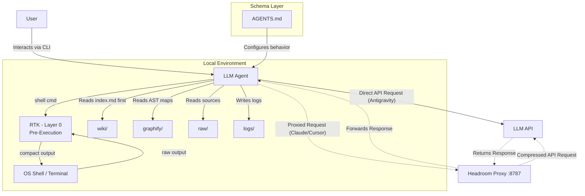

# Architecture Overview

This document provides a deep dive into the technical architecture of the AI-Powered Research Assistant.

## The 5-Layer Architecture

The ecosystem is built on five distinct, orthogonal layers. Each layer has a single responsibility and can be understood independently.

### Layer 0: Pre-Execution Compression (RTK)
Before output is even printed to the terminal, **RTK** intercepts shell commands (`git`, `cargo`, `pip`) and semantically compresses them. This is critical for agents like Google Antigravity that bypass network proxies.

### Layer 1: Network Compression (`headroom proxy`)
For supported clients (Claude Code, Cursor), the **Headroom Proxy** (running locally on port 8787) intercepts raw network requests. It applies AST minification, JSON crushing, and text compression transparently.
- Compresses tool outputs and file reads by 47–92%.
- Shapes model output verbosity (`HEADROOM_OUTPUT_SHAPER=1`) to save up to 30% on output tokens.
- **Optional & Client-Dependent**: Google Antigravity bypasses this proxy entirely.

### Layer 2: Raw Sources (`/raw/`)
Immutable source documents: PDFs, clipped articles, data files. The LLM reads from this layer but NEVER modifies it. This is the ground truth.

### Layer 3: The Wiki (`/wiki/`)
LLM-generated and LLM-maintained markdown files. The agent owns this layer entirely:
- `index.md` -- Central catalog of all wiki pages. The agent reads this first to find relevant context.
- `changelog.md` -- Append-only chronological log of all operations.
- `entities/` -- Pages about specific people, tools, models, datasets.
- `concepts/` -- Pages about techniques, patterns, architectural decisions.
- `synthesis/` -- Filed query answers, comparison tables, and deep analyses.

### Layer 4: The Schema (`agents/`)
Configuration documents (AGENTS.md, .cursorrules) that dictate how the LLM behaves. These turn a generic chatbot into a disciplined wiki maintainer.

## Token Economy

The architecture achieves dramatic, compounding token savings through four orthogonal mechanisms:

### 1. Semantic Reduction (Graphify)
Instead of reading an entire codebase, the agent reads pre-computed AST maps. In our
[FastAPI benchmark](../README.md#token-economy-analysis)
(190,040 tokens for a full-codebase read), this yields **~3,679 tokens**, a **98.06% reduction**
in input token consumption.

### 2. The Index Protocol (Knowledge Retrieval)
Instead of scanning all wiki pages to find context, the agent reads a single `index.md` file (~200-500 tokens) and selectively loads only the 2-3 relevant pages. This prevents token waste on irrelevant content.

### 3. Network Compression (Headroom)
When the agent *does* read a file or runs a tool, the Headroom proxy compresses the raw text/JSON before sending it to the API.

### 4. Memory Optimization (Incremental Logging & Progressive Resume)
By transitioning from heavy terminal-buffer dumps to lightweight `session-trace.md` appends (`/save`) and single-log targeting (`/resume`), the agent entirely eliminates context amnesia while avoiding the immense token penalty of loading full historical transcripts.

**Two separate layers, not one compounding number:** A query that would normally consume 190,040
tokens (reading full codebase) is reduced to ~3,679 tokens by Graphify -- this is the dominant,
architectural lever.
- For **Claude Code**, that payload is then further compressed by Headroom (Layer 1) by a ratio
  that depends on payload verbosity, not a fixed multiplier -- see the
  [Token Economy Analysis](../README.md#token-economy-analysis) for how to measure your own ratio
  with `headroom stats`. RTK (Layer 0) compresses a *different* token stream (local shell/tool
  output, before it reaches the agent's context) and does not stack onto the Headroom-compressed
  API payload figure.
- For **Google Antigravity**, since it connects directly to Google and bypasses Headroom, RTK
  (Layer 0) serves as the exclusive token compressor, drastically reducing shell output tokens
  before Antigravity even reads them. Run `rtk gain` for your real measured savings.

## Operations

The system supports six core operations:

| Operation | Trigger | What Happens |
|---|---|---|
| **Ingest** | Add a source to `raw/` | LLM reads it, writes summary to `wiki/`, updates `index.md` and `changelog.md`. |
| **Query** | Ask a question | LLM reads `index.md`, drills into relevant pages, synthesizes an answer. |
| **File** | `/file` command | A valuable query answer is saved to `wiki/synthesis/`, updating `index.md`. |
| **Lint** | `/lint` command | LLM scans `wiki/` for broken links, orphan pages, stale entries. |
| **Save** | `/save` command | Compiles the running `scratch/session-trace.md` into a permanent `logs/` entry and updates `changelog.md`. Scratch file is then deleted to prevent bloat. |
| **Resume** | `/resume` command | Reads `changelog.md` to load *only* the most recent session log, providing a clean executive summary without bloating the context window. |

## System Flow

