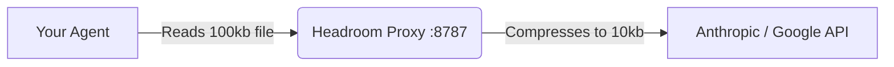

# Headroom Compression Layer

The AI Research Ecosystem uses [Headroom](https://github.com/headroomlabs-ai/headroom) as its **Layer 1 Network Compression Engine**. 

By compressing raw API payloads transparently, Headroom saves 47–92% of your token costs without compromising the quality of the LLM responses.

---

## 1. How It Works: The Transparent Proxy

We do not use Headroom via MCP tools. Instead, we run it as a **Transparent Proxy**. 



The agent is completely unaware of this compression. It just thinks it's talking to the normal API, but the network request is intercepted, crushed, and forwarded.

## 2. Starting the Proxy

Before you start Antigravity, Claude Code, or Cursor, you must run the proxy in a background terminal:

```bash
headroom proxy --port 8787
```

## 3. Configuring Your Agent

You must tell your agent to send its API requests to the proxy instead of the real internet.

**For Claude Code:**
```bash
# Set the base URL environment variable before launching:
export ANTHROPIC_BASE_URL="http://localhost:8787"
claude
```

**For Cursor / Windsurf:**
Set the OpenAI-compatible base URL in your IDE settings to `http://localhost:8787`.

**For Google Antigravity:**
Antigravity connects directly to the Google Gemini API and **does not support proxy interception**. It completely bypasses Headroom. 

> [!WARNING]
> Full proxy-based compression and the Output Shaper (`HEADROOM_OUTPUT_SHAPER`) only work for tools that route traffic through the proxy. Because Antigravity bypasses the proxy, these features will have zero effect when using Antigravity.

## 4. Advanced Configuration

Headroom can be customized using environment variables. The `setup.sh` script automatically configures the most important one for you:

```bash
export HEADROOM_OUTPUT_SHAPER=1
```
*(This appends instructions to the system prompt telling the model to be concise, saving up to 30% on output tokens).*

### Training the Compressor (`headroom learn`)

You can train Headroom to match your specific communication style or project needs:

```bash
headroom learn --verbosity --apply
```

This will run an interactive session to fine-tune the compression weights and automatically save them to a `.local.md` config file.

### A/B Testing

Want to prove how much tokens you are saving? Turn on the holdout mode. This will randomly let 10% of requests go uncompressed so you can compare the token usage.

```bash
export HEADROOM_OUTPUT_HOLDOUT=0.1
```

## 5. Instalação e Troubleshooting Avançado (macOS & Linux)

Durante testes de campo em sistemas reais (especialmente macOS), mapeamos os erros mais comuns e os passos precisos para instalar a Layer 1.

### O Básico da Instalação
O pacote `headroom-ai` está publicado no PyPI. Instale-o com o sufixo `[all]` para incluir as dependências do proxy:
```bash
pip3 install "headroom-ai[all]"
```
*(Nota: O sufixo `[all]` é vital. Se você rodar apenas a instalação base sem o sufixo, ele esquecerá as dependências do servidor proxy como `fastapi` e `httpx[http2]`, causando erro no boot).*

### Erros Comuns e Como Resolver

**1. Erro: `command not found: pip` ou `exit 127`**
* **Causa:** O terminal não encontrou o executável do Headroom (falta de instalação) ou o pip não está no seu PATH. No macOS, o pip se chama `pip3`.
* **Solução:** Rode a instalação usando `pip3 install...` ou `python3 -m pip install...`.

**2. Erro: `Package 'headroom-ai' requires a different Python: 3.9.6 not in '>=3.10'`**
* **Causa:** O ecossistema de IA moderno rejeita o Python 3.9 nativo que vem de fábrica nos Macs antigos.
* **Solução:** **Não tente apagar a versão do sistema.** Baixe o instalador do Python 3.12+ no [python.org](https://www.python.org/downloads/) ou instale via `brew install python`. Após a instalação, feche e abra o terminal para recarregar o PATH.

**3. Erro: `No matching distribution found for headroom-ai[all]`**
* **Causa:** Seu gerenciador `pip` é muito antigo (ex: v21) e não entende os metadados dos pacotes modernos.
* **Solução:** Atualize o pip (`python3 -m pip install --upgrade pip`) e tente novamente.

**4. Erro: `ImportError: Using http2=True, but the 'h2' package is not installed`**
* **Causa:** O proxy exige HTTP/2 para alta performance na compressão de tokens. Acontece se você instalou as dependências pela metade.
* **Solução:** Force a instalação do driver HTTP/2 rodando: `pip3 install "httpx[http2]" fastapi uvicorn`.

### Dica Profissional: Rodando no Background
Para não ocupar uma aba do terminal infinitamente com o servidor ligado, inicie o proxy em background enviando os logs para a pasta temporária:
```bash
nohup headroom proxy --port 8787 > /tmp/headroom.log 2>&1 &
```
Se precisar ver se ele está bem, basta ler o log: `tail -f /tmp/headroom.log`.
