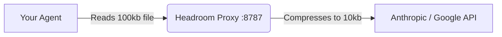

# Headroom Compression Layer

The AI Research Ecosystem uses [Headroom](https://github.com/headroomlabs-ai/headroom) as its **Layer 1 Network Compression Engine**. 

By compressing raw API payloads transparently, Headroom saves 47–92% of your token costs without compromising the quality of the LLM responses.

---

## 1. How It Works: The Transparent Proxy

We do not use Headroom via MCP tools. Instead, we run it as a **Transparent Proxy**. 



The agent is completely unaware of this compression. It just thinks it's talking to the normal API, but the network request is intercepted, crushed, and forwarded.

## 2. Starting the Proxy

Before you start Antigravity, Claude Code, or Cursor, you must run the proxy in a background terminal:

```bash
headroom proxy --port 8787
```

## 3. Configuring Your Agent

You must tell your agent to send its API requests to the proxy instead of the real internet.

**For Claude Code:**
```bash
# Set the base URL environment variable before launching:
export ANTHROPIC_BASE_URL="http://localhost:8787"
claude
```

**For Cursor / Windsurf:**
Set the OpenAI-compatible base URL in your IDE settings to `http://localhost:8787`.

**For Google Antigravity:**
Antigravity does not currently support a configurable API base URL via a simple env var.
The most effective approach is to use the **`HEADROOM_OUTPUT_SHAPER=1`** environment variable (already configured by `setup.sh`) which shapes model output verbosity globally, saving up to 30% on output tokens without requiring proxy routing.

> [!NOTE]
> Full proxy-based compression (the 47–92% input saving) is currently most effective for **Claude Code** and **Cursor** users. Antigravity users still benefit from the output shaper.

## 4. Advanced Configuration

Headroom can be customized using environment variables. The `setup.sh` script automatically configures the most important one for you:

```bash
export HEADROOM_OUTPUT_SHAPER=1
```
*(This appends instructions to the system prompt telling the model to be concise, saving up to 30% on output tokens).*

### Training the Compressor (`headroom learn`)

You can train Headroom to match your specific communication style or project needs:

```bash
headroom learn --verbosity --apply
```

This will run an interactive session to fine-tune the compression weights and automatically save them to a `.local.md` config file.

### A/B Testing

Want to prove how much tokens you are saving? Turn on the holdout mode. This will randomly let 10% of requests go uncompressed so you can compare the token usage.

```bash
export HEADROOM_OUTPUT_HOLDOUT=0.1
```

## 5. Troubleshooting

- **Python Version:** Headroom requires Python 3.10 or higher.
- **AVX2 Warning:** If your CPU doesn't support AVX2, Headroom will fallback to a slower pure-python implementation.
- **Port Conflicts:** If port 8787 is in use, start the proxy with `--port 8788` and update your `ANTHROPIC_BASE_URL` accordingly.
- **Updates:** Keep the compressor updated by running `pip install --upgrade "headroom-ai[all]"`.
