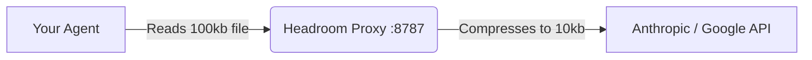

# Headroom Compression Layer

The AI Research Ecosystem uses [Headroom](https://github.com/headroomlabs-ai/headroom) as its **Layer 1 Network Compression Engine**. 

By compressing raw API payloads transparently, Headroom saves 47–92% of your token costs without compromising the quality of the LLM responses.

---

## 1. How It Works: The Transparent Proxy

We do not use Headroom via MCP tools. Instead, we run it as a **Transparent Proxy**. 



The agent is completely unaware of this compression. It just thinks it's talking to the normal API, but the network request is intercepted, crushed, and forwarded.

## 2. Starting the Proxy

Before you start Antigravity, Claude Code, or Cursor, you must run the proxy in a background terminal:

```bash
headroom proxy --port 8787
```

## 3. Configuring Your Agent

You must tell your agent to send its API requests to the proxy instead of the real internet.

> [!TIP]
> **How to verify it's working:** Watch the terminal where `headroom proxy` is running. Every time you ask your agent a question, you should see log lines in the proxy terminal showing token compression ratios. If the proxy terminal is completely silent while your agent is answering, **your agent is bypassing the proxy** and you are not saving tokens!

**For Claude Code:**
If you ran `setup.sh`, you can simply use the pre-configured alias:
```bash
claude-headroom
```
*(If you are setting it up manually, you must export the base URL before launching: `export ANTHROPIC_BASE_URL="http://localhost:8787" && claude`)*

**For Cursor / Windsurf:**
Set the OpenAI-compatible base URL in your IDE settings to `http://localhost:8787`.

**For Google Antigravity:**
Antigravity connects directly to the Google Gemini API and **does not support proxy interception**. It completely bypasses Headroom. 

> [!WARNING]
> Full proxy-based compression and the Output Shaper (`HEADROOM_OUTPUT_SHAPER`) only work for tools that route traffic through the proxy. Because Antigravity bypasses the proxy, these features will have zero effect when using Antigravity.

## 4. Advanced Configuration

Headroom can be customized using environment variables. The `setup.sh` script automatically configures the most important one for you:

```bash
export HEADROOM_OUTPUT_SHAPER=1
```
*(This appends instructions to the system prompt telling the model to be concise, saving up to 30% on output tokens).*

### Training the Compressor (`headroom learn`)

You can train Headroom to match your specific communication style or project needs:

```bash
headroom learn --verbosity --apply
```

This will run an interactive session to fine-tune the compression weights and automatically save them to a `.local.md` config file.

### A/B Testing

Want to prove how much tokens you are saving? Turn on the holdout mode. This will randomly let 10% of requests go uncompressed so you can compare the token usage.

```bash
export HEADROOM_OUTPUT_HOLDOUT=0.1
```

## 5. Advanced Installation and Troubleshooting (macOS & Linux)

During field tests on real systems (especially macOS), we mapped the most common errors and the precise steps to install Layer 1.

### Installation Basics
The `headroom-ai` package is published on PyPI. Install it with the `[all]` suffix to include the proxy dependencies:
```bash
pip3 install "headroom-ai[all]"
```
*(Note: The `[all]` suffix is vital. If you only run the base installation without the suffix, it will miss the proxy server dependencies like `fastapi` and `httpx[http2]`, causing boot errors).*

### Common Errors and How to Solve Them

**1. Error: `command not found: pip` or `exit 127`**
* **Cause:** The terminal did not find the Headroom executable (missing installation) or pip is not in your PATH. On macOS, pip is called `pip3`.
* **Solution:** Run the installation using `pip3 install...` or `python3 -m pip install...`.

**2. Error: `Package 'headroom-ai' requires a different Python: 3.9.6 not in '>=3.10'`**
* **Cause:** The modern AI ecosystem rejects the native Python 3.9 that comes pre-installed on older Macs.
* **Solution:** **Do not try to delete the system version.** Download the Python 3.12+ installer from [python.org](https://www.python.org/downloads/) or install via `brew install python`. After installation, close and reopen the terminal to reload the PATH.

**3. Error: `No matching distribution found for headroom-ai[all]`**
* **Cause:** Your `pip` package manager is too old (e.g., v21) and cannot understand the metadata of modern packages.
* **Solution:** Upgrade pip (`python3 -m pip install --upgrade pip`) and try again.

**4. Error: `ImportError: Using http2=True, but the 'h2' package is not installed`**
* **Cause:** The proxy requires HTTP/2 for high-performance token compression. This happens if you only partially installed the dependencies.
* **Solution:** Force the installation of the HTTP/2 driver by running: `pip3 install "httpx[http2]" fastapi uvicorn`.

### Pro Tip: Running in the Background
To avoid occupying a terminal tab indefinitely with the running server, start the proxy in the background and pipe the logs to a temporary folder:
```bash
nohup headroom proxy --port 8787 > /tmp/headroom.log 2>&1 &
```
If you need to check if it's running properly, just read the log: `tail -f /tmp/headroom.log`.
